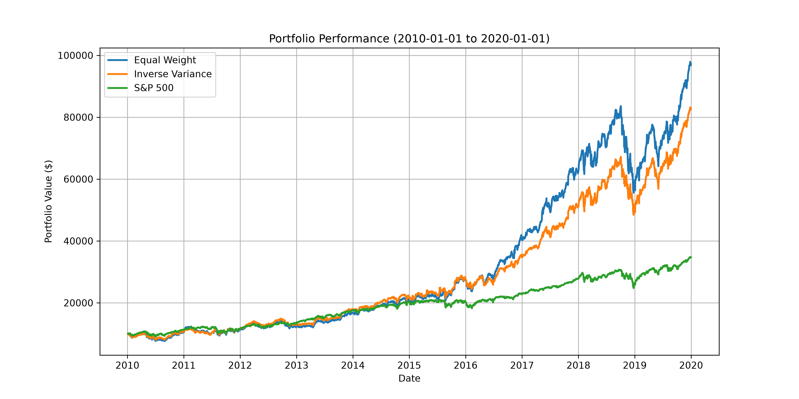
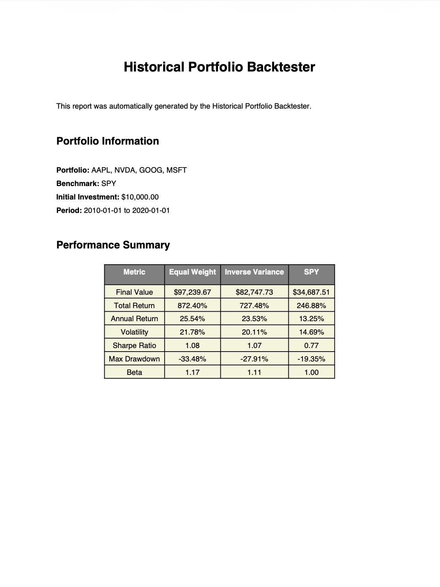
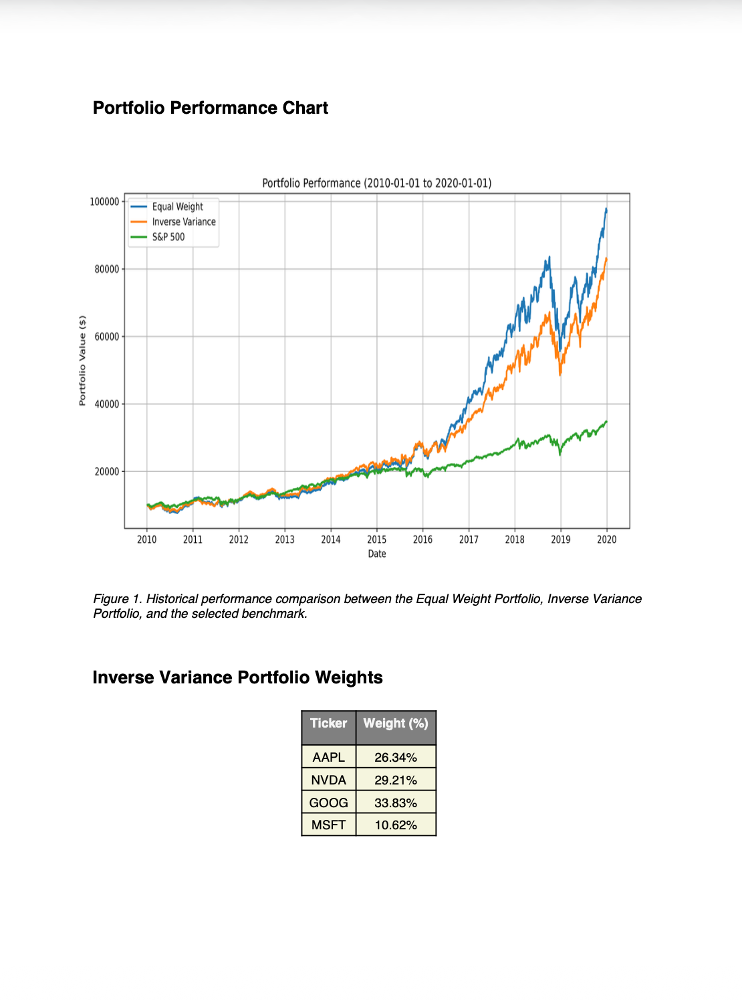
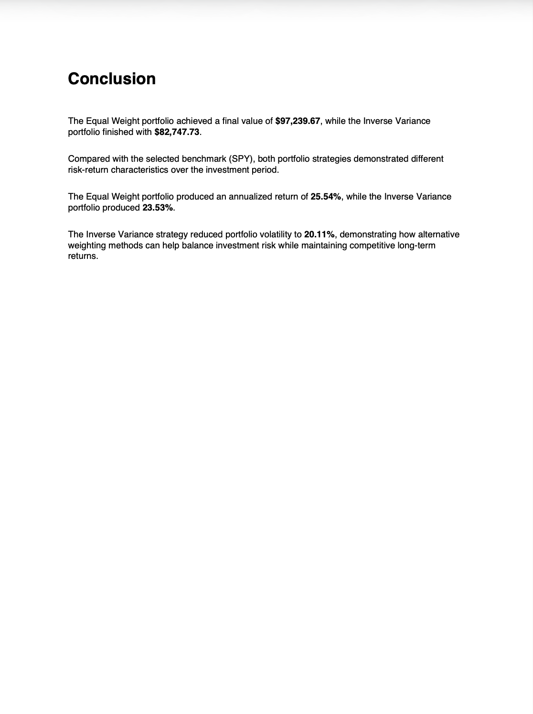

# Historical Portfolio Backtester

A Python application for backtesting stock portfolios.

## Features

- Build custom stock portfolios using user-selected tickers
- Compare portfolio performance against a benchmark
- Analyze multiple portfolio weighting strategies:
  - Equal Weight Portfolio
  - Inverse Variance Portfolio
- Calculate key portfolio performance metrics
- Generate historical performance charts
- Automatically generate a professional PDF report
- Display inverse variance portfolio allocation weights

## Performance Metrics

The application calculates:

- Final Portfolio Value
- Total Return
- Annualized Return
- Annualized Volatility
- Sharpe Ratio
- Maximum Drawdown
- Beta

## Technologies Used

- Python
- pandas
- NumPy
- yfinance
- Matplotlib
- ReportLab

## Project Structure

```text
HistoricalPortfolioBacktester/
│
├── src/
│   ├── main.py
│   ├── data_loader.py
│   ├── portfolio.py
│   ├── metrics.py
│   └── report.py
│
├── data/
│   ├── Portfolio_Report.pdf
│   └── portfolio_comparison.png
│
├── images/
│
├── requirements.txt
└── README.md
```

## How It Works

1. Enter stock tickers for your portfolio.
2. Select a benchmark ticker.
3. Choose the investment period.
4. Enter the initial investment amount.
5. Historical market data is downloaded from Yahoo Finance.
6. Portfolio returns are calculated using Equal Weight and Inverse Variance strategies.
7. Performance metrics are computed.
8. A historical performance chart is generated.
9. A professional multi-page PDF report is automatically created.

## Example

### Input

```text
Portfolio:
AAPL, NVDA, MSFT, GOOG

Benchmark:
SPY

Investment Period:
2015-01-01 to 2025-01-01

Initial Investment:
$10,000
```

### Output

- Historical portfolio performance chart
- Portfolio performance metrics
- Portfolio allocation weights
- Professional PDF report

## Screenshots

### Portfolio Performance Chart



### PDF Report (Page 1)



### PDF Report (Page 2)



### PDF Report (Page 3)



## Installation

Clone the repository:

```bash
git clone https://github.com/chrisjung0919/HistoricalPortfolioBacktester.git
```

Navigate to the project:

```bash
cd HistoricalPortfolioBacktester
```

Install dependencies:

```bash
pip install -r requirements.txt
```

Run the application:

```bash
python src/main.py
```

## Unit Testing

The project includes unit tests for the portfolio performance metrics implemented in `metrics.py`. The tests are written using **pytest** and verify the correctness of each financial calculation.

### Tested Functions

- Annualized Volatility
- Total Return
- Annualized Return (CAGR)
- Sharpe Ratio
- Maximum Drawdown
- Portfolio Beta

### Running the Tests

Install the required dependencies:

```bash
pip install -r requirements.txt
```

Run all unit tests from the project root:

```bash
python -m pytest
```

Expected output:

```text
============================= test session starts =============================
collected 7 items

tests/test_metrics.py .......

============================== 7 passed ==============================
```

The tests are located in:

```text
tests/
└── test_metrics.py
```

## Future Improvements

- Mean-Variance Portfolio Optimization
- Efficient Frontier Visualization
- Monte Carlo Portfolio Simulation
- Portfolio Rebalancing
- CSV Export
- Interactive Web Application (Streamlit)

## Data Source

Historical market data is provided by **Yahoo Finance** through the **yfinance** Python library.

## Author

**Christopher Jung**

Applied Mathematics  
University of California, Berkeley
